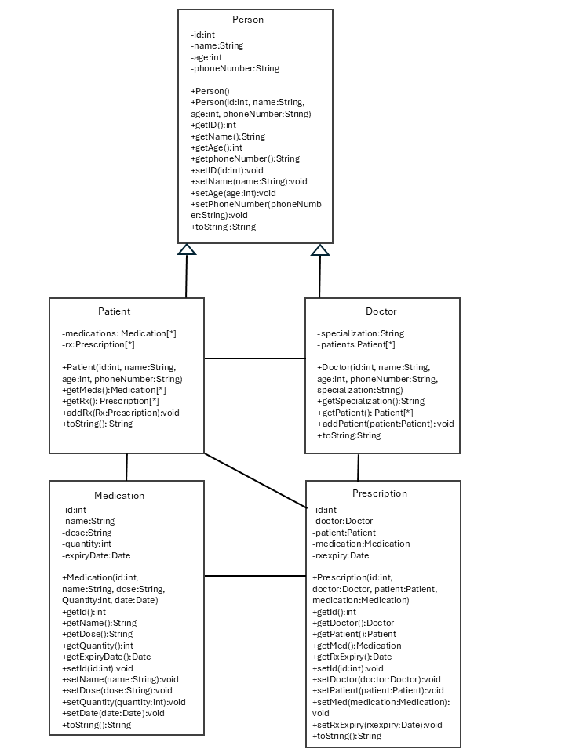

# Medical Clinic Prescritption Management System

## 1.0 User Documentation

### Application Overview
This application is a console-based management system designed for a medical clinic. It allows clinic staff to manage core data relationships between Doctors, Patients, and Medication inventory.
The system acts as a real-time reporting engine, tracking active prescriptions, flagging expired medications for safety audits, and archiving patient prescription histories to ensure regulatory compliance and efficient clinic operations.

## 1.2 Class Descriptions and Workings
The system is built using Object-Oriented Programming (OOP) principles, utilizing four core classes that interact with one another:
**Doctor:** Represents the clinic's medical staff. It handles the doctor's identification details and manages a collection of their assigned patients.
**Patient:** Represents the individuals receiving care. It holds their personal information and maintains a dedicated list of their unique prescriptions.
**Medication:** Represents the pharmacy inventory, tracking specific drug names, unit quantities, and warehouse expiration dates.
**Prescription:** Acts as the central link connecting a specific Doctor, a Patient, and a Medication together, automatically calculating a pharmacy expiration date upon creation.

### 1.3 User Guide: Accessing and Navigating the System
The application features a fully interactive, text-based console menu. When started, users are presented with a main menu to choose which data sector they want to manage.

#### Navigation Steps:
**Launch the Application:** Run 'java MedicationSystem' is the CLI to display the main system options.
**Select a Category:** 
The application features a fully interactive, text-based console menu. When started, users navigate the system by entering a number from `1` to `9` to execute specific tasks
   **1** - Add a New Patient
   **2** - Add a New Doctor
   **3** - Add a New Medication
   **4** - Restock Medication
   **5** - Edit Patient Details
   **6** - Delete a Patient
   **7** - Search by name
   **8** - Generate System Reports (Opens the Reports Submenu)
   **9** - Exit the Application

### 1.4 System Class Diagram
The diagram below illustrates the UML architecture of the clinic management system, detailing the attributes, methods, and structural associations between the core classes.

## 2.0 Technical Documentation

### 2.1 Directory Structure
ClinicManagementSystem/
├── src/
│   ├── Doctor.java
│   ├── Patient.java
│   ├── Medication.java
│   ├── Prescription.java
│   └── MedicationSystem.java
├── bin/
│   ├── Doctor.class
│   ├── Patient.class
│   ├── Medication.class
│   ├── Prescription.class
│   └── MedicationSystem.class
└── doc/
    └── (Generated JavaDoc HTML files and stylesheets)

 
